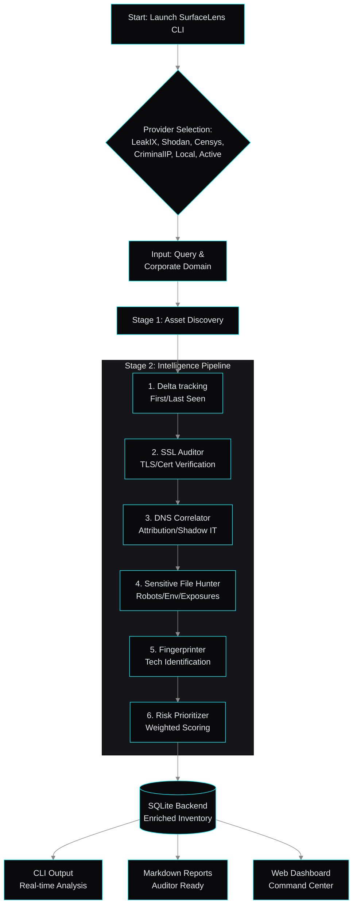

# 🛰️ SurfaceLens V2


**SurfaceLens V2** is a modular **Attack Surface Management (ASM) & Shadow IT Intelligence Engine**. It aggregates data from multiple global providers to help security teams identify exposed assets, verify attribution, and score risks—all through a unified intelligence pipeline.

---

## 🔍 Why SurfaceLens V2?

In the age of cloud sprawl, organizations struggle with **Shadow IT**:
* **Subdomain Takeovers:** Forgotten DNS records pointing to dead IPs.
* **Exposed Admin Panels:** RDP, SSH, and Database ports left open to the world.
* **Attribution Gaps:** Assets owned by the company that don't match corporate DNS patterns.
* **Compliance Drift:** Services running outdated TLS or missing security headers.

SurfaceLens provides a **tactical map** of your exposure, allowing you to move from reactive firefighting to proactive surface hardening.

---

## 🏗️ Architecture Overview



---

## ⚙️ How the Pipeline Works

1. **Discovery (Multi-Source)** Aggregate raw asset data from **LeakIX, Shodan, Censys, CriminalIP**, or **Local Datasets**.

2. **Deduplication & Delta Tracking** The engine cross-references findings with a local SQLite database to track **First Seen** timestamps and identify new exposures.

3. **Intelligence Pipeline (The "Brain")** Every asset is passed through specialized diagnostic modules:
   * **SSL Auditor:** Extracts certificates and verifies TLS protocols.
   * **DNS Correlator:** Performs reverse DNS lookups and checks for domain affiliation/Shadow IT.
   * **Fingerprinter:** Identifies web servers and technologies (Cloudflare, Nginx, etc.).
   * **Hunter:** Probes for common sensitive file exposures (e.g., `robots.txt`, `.env`).
   * **Risk Prioritizer:** Calculates a weighted 0–10 risk score based on all findings.

4. **Visualization & Reporting**
   * **CLI:** High-fidelity terminal output with color-coded risk levels.
   * **Markdown:** Audit-ready reports for documentation.
   * **Dashboard:** A Flask-powered Dark Mode web UI for inventory management.

---

## 🚀 Installation

```bash
# Clone the repository
git clone https://github.com/404saint/surfacelens_v2.git
cd surfacelens_v2

# Install dependencies
pip install -r requirements.txt
```

### 🔑 Configuration
SurfaceLens is modular. You only need keys for the providers you intend to use. Export them to your environment:

```bash
export SHODAN_API_KEY='your_key'
export LEAKIX_API_KEY='your_key'
# Works out-of-the-box for 'active' and 'local' modes!
```

---

## 🛠️ Usage

### Command Line Interface
Run the main engine to start a scan and generate reports:
```bash
python3 surfacelens.py
```
*Use `python3 surfacelens.py --reset` to wipe the local database and start fresh.*

### Intelligence Dashboard
Launch the web-based inventory to browse your discovered assets:
```bash
python3 dashboard.py
```
Access the UI at: `http://127.0.0.1:5000`

---

## 🛡️ Ethical Use
SurfaceLens is designed for **defensive security research** and **authorized auditing**. It uses passive data sources and non-intrusive active checks. Do not use this tool on infrastructure you do not have explicit permission to assess.

## 📄 License
Distributed under the MIT License. See `LICENSE` for more information.
